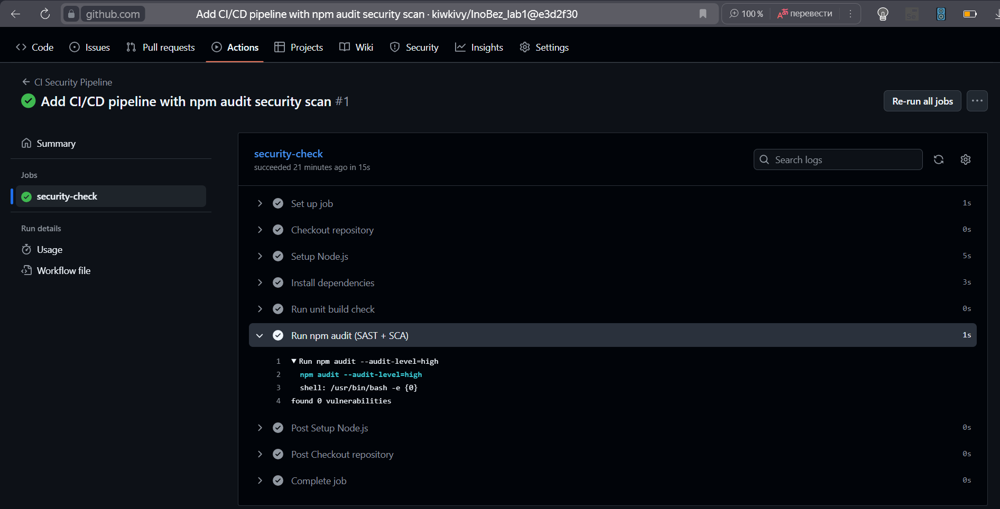

# Lab1: Защищенный REST API с интеграцией в CI/CD

## Описание проекта

Проект представляет собой простой REST API на Node.js с использованием Express и SQLite. Цель — показать навыки разработки безопасного backend-приложения с аутентификацией, защитой от OWASP Top 10 и интеграцией в CI/CD.

### Технологии
- Node.js + Express

---

## API

### 1. `POST /auth/register`
Регистрация нового пользователя.

**Тело запроса (JSON):**
```json
{
  "username": "имя_пользователя",
  "password": "пароль"
}
````

**Пример curl:**

```bash
curl -X POST http://localhost:3000/auth/register \
-H "Content-Type: application/json" \
-d '{"username":"admin","password":"password123"}'
```

**Ответ:**

```json
{
  "message": "User registered successfully"
}
```

---

### 2. `POST /auth/login`

Логин пользователя и получение JWT-токена.

**Тело запроса (JSON):**

```json
{
  "username": "имя_пользователя",
  "password": "пароль"
}
```

**Пример curl:**

```bash
curl -X POST http://localhost:3000/auth/login \
-H "Content-Type: application/json" \
-d '{"username":"admin","password":"password123"}'
```

**Ответ:**

```json
{
  "token": "<JWT_TOKEN>"
}
```

---

### 3. `GET /api/data`

Получение защищённых данных. Доступ только с JWT-токеном.

**Пример curl:**

```bash
curl http://localhost:3000/api/data \
-H "Authorization: Bearer <JWT_TOKEN>"
```

**Ответ:**

```json
{
  "user": "admin",
  "data": [
    { "id": 1, "text": "&lt;script&gt;alert(&quot;xss&quot;)&lt;/script&gt;" },
    { "id": 2, "text": "Secure API data" }
  ]
}
```

❌ Без токена → `401 Unauthorized`.

---

## Реализованные меры защиты

### 1. SQL Injection (SQLi)

* Используется ORM **Sequelize**, который генерирует безопасные SQL-запросы.
* Никакой конкатенации строк в SQL-запросах нет.
* Все данные передаются через параметры ORM.

### 2. Cross-Site Scripting (XSS)

* Все пользовательские данные перед отправкой в ответ API проходят **санитизацию** через `escape-html`.
* Пример: `<script>alert("xss")</script>` превращается в `&lt;script&gt;alert(&quot;xss&quot;)&lt;/script&gt;`.

### 3. Broken Authentication

* Пароли **хэшируются с помощью bcrypt** перед сохранением.
* Аутентификация выполняется через **JWT**, который проверяется в middleware.
* JWT имеет время жизни (1 час) и подписан секретным ключом из `.env`.
* Все защищённые маршруты требуют валидный токен в `Authorization` header.

---

## CI/CD и безопасность

Настроен **GitHub Actions**:

* При каждом `push` и `pull request` автоматически:

  * Устанавливаются зависимости
  * Запускается проверка уязвимостей через `npm audit` (SAST + SCA)

Pipeline блокирует сборку при критических уязвимостях уровня High и Critical.

### Скриншоты отчетов

**1. Успешный запуск pipeline:**


**2. Результаты SAST/SCA (npm audit):**


> Вставьте сюда свои скриншоты после проверки GitHub Actions.

---

## Запуск проекта локально

1. Клонировать репозиторий:

```bash
git clone https://github.com/<username>/lab1.git
cd lab1
```

2. Установить зависимости:

```bash
npm install
```

3. Создать `.env` файл:

```env
PORT=3000
JWT_SECRET=super_secret_key_123
JWT_EXPIRES_IN=1h
```

4. Запустить сервер:

```bash
npm run dev
```

API будет доступен по адресу: `http://localhost:3000`

---

## Структура проекта

```
lab1/
├── src/
│   ├── app.js
│   ├── server.js
│   ├── config/
│   │   └── database.js
│   ├── models/
│   │   └── User.js
│   ├── controllers/
│   │   ├── auth.controller.js
│   │   └── data.controller.js
│   ├── routes/
│   │   ├── auth.routes.js
│   │   └── data.routes.js
│   ├── middleware/
│   │   └── auth.middleware.js
│   └── utils/
│       └── sanitizer.js
├── .env
├── package.json
├── package-lock.json
├── database.sqlite
├── README.md
└── .github/workflows/ci.yml
```

---

## Контакты / Авторы

* Студент: Гладкая Ксения 
* Группа: P3419


